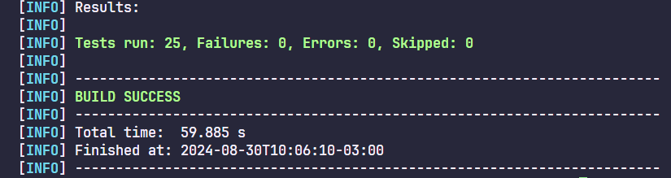

## Desafio BugBank

<div align="center">

</div>

## 📋 Descrição

Este projeto foi criado como parte do desafio Bugbank, focando na automação de testes utilizando Selenium e Java. O objetivo principal foi garantir a qualidade e confiabilidade das funcionalidades da aplicação Bugbank através de testes automatizados. O projeto abrange todo o ciclo de testes, desde o planejamento até a implementação, com uma integração eficiente usando Cucumber para escrever os testes em Gherkin.

## 🚀 Tecnologias Utilizadas

- Java: Linguagem principal utilizada para escrever os testes.
- Selenium: Ferramenta para automação de navegadores, utilizada para interagir com a interface da aplicação Bugbank.
- Cucumber: Utilizado para criar cenários de testes em Gherkin, facilitando a compreensão e a colaboração entre as equipes.
- JUnit: Framework de testes utilizado para estruturar e executar os testes automatizados.

### 🛠️ Funcionalidades Implementadas

- Planejamento de Testes: Criação de um plano de testes completo, cobrindo todas as funcionalidades críticas da aplicação Bugbank.
- Cenários de Testes: Definição de cenários de testes claros e abrangentes, garantindo a cobertura de todos os casos de uso.
- Automação: Implementação da automação de testes com Selenium e Java, permitindo a execução repetida dos testes de forma eficiente.
- Integração com Cucumber: Escrita dos testes em Gherkin, permitindo a criação de testes legíveis e fáceis de entender.

### 🔍 Como Executar

Passo-a-passo para que você tenha um ambiente de desenvolvimento em execução.

1. Clone o repositório:

   ```sh
   git clone https://github.com/ChaiCaroline/Desafio-BugBank
   ```

2. Navegue até o diretório do projeto:

   ```sh
   cd Automacao
   ```

3. Compile o projeto usando Maven:

   ```sh
   mvn clean install
   ```

4. Execute os testes:
   ```sh
   mvn test
   ```

### 🔩 Resultado dos Testes

Confira o resultado abaixo resultado aa execução dos testes automatizados:

<div align="center">

</div>

## 📦 Estrutura do Projeto

```plaintext
|-- src/
|   |-- main/
|   |   |-- java/
|   |   |   |-- pages/
|   |   |   |-- utils/
|   |-- test/
|   |   |-- java/
|   |   |   |-- hooks/
|   |   |   |-- runners/
|   |   |   |-- steps/
|   |   |-- resources/
|   |   |   |-- features/
|-- pom.xml
|-- README.md
```

## Referência

- [Documentação Selenium Boas Práticas.](https://www.selenium.dev/pt-br/documentation/test_practices/design_strategies/)
- [Trilha de Estudo - Alura](https://cursos.alura.com.br/meu-plano-de-estudos-chaiene-rocha-1712705751690-p753183)
- [Documentação cucummber](https://cucumber.io/docs/cucumber/)
- [Site BugBank](https://bugbank.netlify.app/)

## ✒️ Autores

Mencione todos aqueles que ajudaram a levantar o projeto desde o seu início

- Chaiene - [GitHub](https://github.com/ChaiCaroline) - [Linkedin](https://www.linkedin.com/in/chaiene-caroline/)
